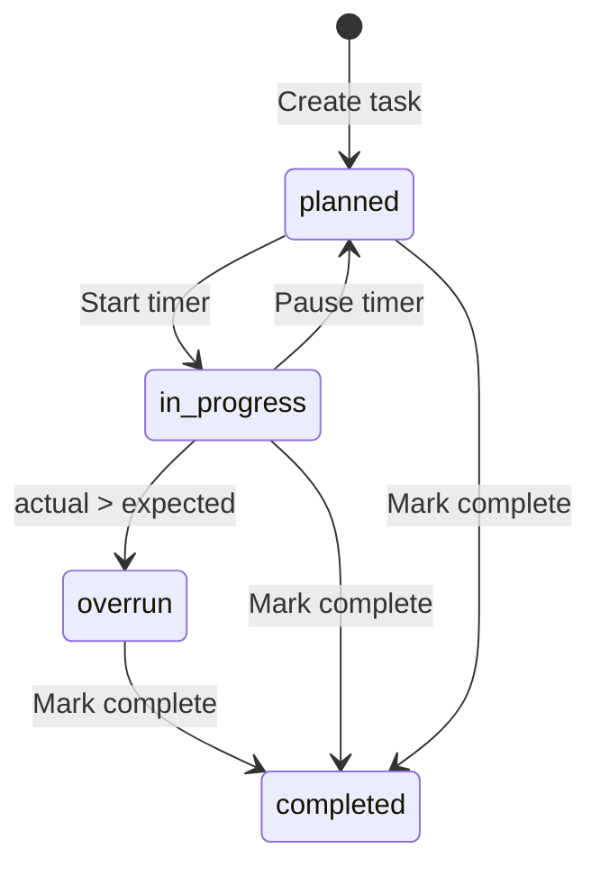

# Phase 2: Task Management

## Overview

Build the core task CRUD system with time tracking and the left-panel table view, following Swiss minimal design principles with clean typography and subtle interactions.

---

## Pages & Components

### `/dashboard` — Task Table View (Left Panel)

```
┌────────────────────────────────────────────────────────────┐
│ Task Name          │ Description    │ Time │ Timer        │
├────────────────────┼────────────────┼──────┼──────────────┤
│ Design schema      │ Create secure… │ 2h   │ [▶ Start]    │
│ Build auth flow    │ Supabase in…   │ 1.5h │ [⏸ 0:45:20] │
│ Write API routes   │ REST endpoi…   │ 3h   │ [▶ Start]    │
├────────────────────┴────────────────┴──────┴──────────────┤
│ [+ Add Task]                                              │
└────────────────────────────────────────────────────────────┘
```

#### Table Design Specifications

**Table Container**:
```css
background: var(--bg-primary)
border: 1px solid var(--border-primary)
border-radius: var(--radius-md)  /* 6px */
overflow: hidden
```

**Table Header Row**:
```css
background: var(--bg-tertiary)
border-bottom: 1px solid var(--border-primary)
```

**Table Header Cell**:
```css
color: var(--text-secondary)
font-size: var(--font-size-xs)  /* 12px */
font-weight: var(--font-weight-semibold)  /* 600 */
text-transform: uppercase
letter-spacing: var(--letter-spacing-wide)  /* 0.05em */
padding: 12px 16px
text-align: left
```

**Table Body Row**:
```css
height: 48px  /* Base row height */
border-bottom: 1px solid var(--border-secondary)
transition: background-color 150ms ease-out
cursor: pointer

&:last-child {
  border-bottom: none
}

&:hover {
  background: var(--bg-hover)
}
```

**Table Cell**:
```css
padding: 12px 16px
color: var(--text-primary)
font-size: 14px
vertical-align: middle

/* Task Name Cell */
&.task-name {
  font-weight: var(--font-weight-medium)
  max-width: 200px
  overflow: hidden
  text-overflow: ellipsis
  white-space: nowrap
}

/* Description Cell */
&.description {
  color: var(--text-secondary)
  max-width: 250px
  overflow: hidden
  text-overflow: ellipsis
  white-space: nowrap
}

/* Time Cell */
&.time {
  font-family: var(--font-family-mono)
  color: var(--text-secondary)
  font-size: 13px
  width: 80px
}
```

**Timer Button States**:
```css
/* Start Button */
.timer-start {
  display: inline-flex
  align-items: center
  gap: 6px
  padding: 6px 12px
  height: 32px
  background: transparent
  border: 1px solid var(--border-primary)
  border-radius: var(--radius-sm)
  color: var(--text-secondary)
  font-size: 13px
  font-weight: var(--font-weight-medium)
  cursor: pointer
  transition: all 150ms ease-out

  svg {
    width: 16px
    height: 16px
  }

  &:hover {
    background: var(--bg-hover)
    border-color: var(--border-hover)
    color: var(--text-primary)
  }
}

/* Active Timer (Pause) */
.timer-active {
  background: var(--info-bg)
  border-color: var(--info-border)
  color: var(--info-text)

  &:hover {
    background: var(--info-solid)
    color: white
  }
}

/* Timer Display */
.timer-display {
  font-family: var(--font-family-mono)
  font-size: 13px
  min-width: 60px
  text-align: center
}
```

**Add Task Button**:
```css
display: flex
align-items: center
justify-content: center
gap: 8px
width: 100%
padding: 12px
background: var(--bg-secondary)
border: none
border-top: 1px solid var(--border-secondary)
color: var(--text-secondary)
font-size: 14px
font-weight: var(--font-weight-medium)
cursor: pointer
transition: all 150ms ease-out

svg {
  width: 16px
  height: 16px
}

&:hover {
  background: var(--bg-hover)
  color: var(--text-primary)
}
```

**Columns**:
| Column | Editable | Notes |
|--------|----------|-------|
| Task Name | Click to open modal | Truncate at 30 chars |
| Description | No (read-only) | 1-line truncate |
| Expected Time | Inline edit | Format: `Xh Ym` |
| Timer | Button | Start/Pause/Resume |

---

### Task Detail Modal

```
┌─────────────────────────────────────────────────┐
│ Design database schema                      [×] │
├─────────────────────────────────────────────────┤
│ Status:     [ Planned ▼ ]                       │
│ Owner:      [ John Doe ▼ ]                      │
│ Expected:   [ 2h 00m ]                          │
│ Actual:     1h 23m (auto-calculated)            │
├─────────────────────────────────────────────────┤
│ Description:                                    │
│ ┌─────────────────────────────────────────────┐ │
│ │ Create a secure, scalable database schema  │ │
│ │ for the team execution platform...         │ │
│ └─────────────────────────────────────────────┘ │
├─────────────────────────────────────────────────┤
│ Visibility: ( ) Private (•) Leaders Only ( ) Team │
├─────────────────────────────────────────────────┤
│         [ Delete ]              [ Save ]        │
└─────────────────────────────────────────────────┘
```

#### Modal Design Specifications

**Modal Overlay**:
```css
position: fixed
inset: 0
background: rgba(0, 0, 0, 0.5)  /* light mode */
background: rgba(0, 0, 0, 0.8)  /* dark mode */
backdrop-filter: blur(4px)
display: flex
align-items: center
justify-content: center
z-index: 1000
animation: fadeIn 200ms ease-out
```

**Modal Panel**:
```css
max-width: 640px
width: 90%
background: var(--bg-elevated)
border: 1px solid var(--border-primary)
border-radius: var(--radius-lg)  /* 8px */
box-shadow: var(--shadow-xl)
animation: scaleIn 200ms ease-out
overflow: hidden
```

**Modal Header**:
```css
padding: 24px 32px
border-bottom: 1px solid var(--border-primary)
display: flex
align-items: center
justify-content: space-between

h2 {
  font-size: var(--font-size-xl)  /* 20px */
  font-weight: var(--font-weight-semibold)
  color: var(--text-primary)
  flex: 1
  margin-right: 16px
}
```

**Close Button**:
```css
width: 32px
height: 32px
display: flex
align-items: center
justify-content: center
background: transparent
border: none
border-radius: var(--radius-sm)
color: var(--text-tertiary)
cursor: pointer
transition: all 150ms ease-out

svg {
  width: 20px
  height: 20px
}

&:hover {
  background: var(--bg-hover)
  color: var(--text-primary)
}
```

**Modal Body**:
```css
padding: 24px 32px
display: flex
flex-direction: column
gap: 20px
```

**Form Field Group**:
```css
display: flex
flex-direction: column
gap: 8px

label {
  color: var(--text-secondary)
  font-size: 14px
  font-weight: var(--font-weight-medium)
}
```

**Select Dropdown**:
```css
height: 40px
padding: 0 16px
background: var(--bg-primary)
border: 1px solid var(--border-primary)
border-radius: var(--radius-sm)
color: var(--text-primary)
font-size: var(--font-size-base)
cursor: pointer
transition: all 150ms ease-out

&:hover {
  border-color: var(--border-hover)
}

&:focus {
  border-color: var(--border-focus)
  outline: 2px solid var(--border-focus)
  outline-offset: 2px
}
```

**Textarea**:
```css
min-height: 120px
padding: 12px 16px
background: var(--bg-primary)
border: 1px solid var(--border-primary)
border-radius: var(--radius-sm)
color: var(--text-primary)
font-size: var(--font-size-base)
font-family: var(--font-family-sans)
resize: vertical
transition: all 150ms ease-out

&::placeholder {
  color: var(--text-tertiary)
}

&:hover {
  border-color: var(--border-hover)
}

&:focus {
  border-color: var(--border-focus)
  outline: 2px solid var(--border-focus)
  outline-offset: 2px
}
```

**Radio Button Group**:
```css
display: flex
gap: 16px

.radio-option {
  display: flex
  align-items: center
  gap: 8px
  cursor: pointer

  input[type="radio"] {
    width: 16px
    height: 16px
    accent-color: var(--orange-600)
  }

  label {
    color: var(--text-primary)
    font-size: 14px
    cursor: pointer
  }
}
```

**Modal Footer**:
```css
padding: 16px 32px
border-top: 1px solid var(--border-primary)
display: flex
justify-content: space-between
align-items: center
```

**Delete Button (Danger)**:
```css
height: 40px
padding: 12px 20px
background: transparent
border: 1px solid var(--error-border)
border-radius: var(--radius-sm)
color: var(--error-text)
font-size: 14px
font-weight: var(--font-weight-semibold)
cursor: pointer
transition: all 150ms ease-out

&:hover {
  background: var(--error-bg)
  border-color: var(--error-solid)
  color: var(--error-solid)
}
```

**Save Button (Primary)**:
```css
/* Same as primary button from Phase 1 */
height: 40px
padding: 12px 20px
background: var(--orange-600)
color: white
font-size: 14px
font-weight: var(--font-weight-semibold)
border: none
border-radius: var(--radius-sm)
cursor: pointer
transition: all 150ms ease-out

&:hover {
  background: var(--orange-700)
  box-shadow: var(--shadow-sm)
}
```

---

## Status Badge Specifications

```css
.status-badge {
  display: inline-flex
  align-items: center
  gap: 6px
  padding: 4px 10px
  height: 24px
  border-radius: var(--radius-full)
  font-size: 12px
  font-weight: var(--font-weight-medium)
}

/* Planned (Neutral) */
.status-planned {
  background: var(--bg-tertiary)
  color: var(--text-secondary)
  border: 1px solid var(--border-primary)
}

/* In Progress (Blue) */
.status-in-progress {
  background: var(--info-bg)
  color: var(--info-text)
  border: 1px solid var(--info-border)
}

/* Completed (Green) */
.status-completed {
  background: var(--success-bg)
  color: var(--success-text)
  border: 1px solid var(--success-border)
}

/* Overrun (Red) */
.status-overrun {
  background: var(--error-bg)
  color: var(--error-text)
  border: 1px solid var(--error-border)
}

/* Status Dot Indicator */
.status-dot {
  width: 6px
  height: 6px
  border-radius: 50%
  display: inline-block
}
```

---

## Database Interactions

### Create Task

```typescript
const createTask = async (task: NewTask) => {
  const { data, error } = await supabase
    .from('tasks')
    .insert({
      organization_id: orgId,
      owner_id: userId,
      created_by: userId,
      title: task.title,
      description: task.description,
      expected_time_minutes: task.expectedMinutes,
      visibility: task.visibility ?? 'leaders_only'
    })
    .select()
    .single();
  return data;
};
```

### Fetch Tasks (with RLS auto-filter)

```typescript
const fetchTasks = async () => {
  const { data } = await supabase
    .from('tasks')
    .select(`
      id, title, description, status,
      expected_time_minutes, actual_time_minutes,
      visibility, owner_id,
      owner:user_profiles!owner_id(display_name)
    `)
    .eq('organization_id', orgId)
    .is('deleted_at', null)
    .order('created_at', { ascending: false });
  return data;
};
```

### Timer Start/Stop

```typescript
// Start timer
const startTimer = async (taskId: string) => {
  await supabase.from('time_logs').insert({
    task_id: taskId,
    user_id: userId,
    organization_id: orgId,
    started_at: new Date().toISOString()
  });

  await supabase.from('tasks')
    .update({ status: 'in_progress' })
    .eq('id', taskId);
};

// Stop timer
const stopTimer = async (logId: string) => {
  await supabase.from('time_logs')
    .update({ ended_at: new Date().toISOString() })
    .eq('id', logId);
  // Trigger auto-calculates duration_minutes
  // Trigger updates task.actual_time_minutes
};
```

### Get Active Timer

```typescript
const getActiveTimer = async () => {
  const { data } = await supabase
    .from('time_logs')
    .select('id, task_id, started_at')
    .eq('user_id', userId)
    .is('ended_at', null)
    .single();
  return data;
};
```

---

## Components

```
components/
├── tasks/
│   ├── TaskTable.tsx        # Main table component
│   ├── TaskRow.tsx          # Individual row with timer
│   ├── TaskModal.tsx        # Detail/edit modal
│   ├── TaskForm.tsx         # Create new task form
│   ├── Timer.tsx            # Live countdown/up display
│   └── TimeInput.tsx        # Inline time editor (Xh Ym)
└── ui/
    ├── Modal.tsx
    ├── InlineEdit.tsx
    ├── Badge.tsx
    └── Select.tsx
```

---

## Time Display Utilities

```typescript
// lib/utils/time.ts
export function formatMinutes(minutes: number): string {
  const h = Math.floor(minutes / 60);
  const m = minutes % 60;
  return h > 0 ? `${h}h ${m}m` : `${m}m`;
}

export function parseTimeInput(input: string): number {
  // Parse "2h 30m" or "150m" or "2.5h"
  const hours = input.match(/(\d+(?:\.\d+)?)\s*h/i);
  const mins = input.match(/(\d+)\s*m/i);
  return (hours ? parseFloat(hours[1]) * 60 : 0) +
         (mins ? parseInt(mins[1]) : 0);
}
```

---

## Real-time Subscriptions

```typescript
// Subscribe to task changes for live updates
useEffect(() => {
  const channel = supabase
    .channel('tasks-changes')
    .on('postgres_changes', {
      event: '*',
      schema: 'public',
      table: 'tasks',
      filter: `organization_id=eq.${orgId}`
    }, (payload) => {
      // Update local state
      refetchTasks();
    })
    .subscribe();

  return () => { supabase.removeChannel(channel); };
}, [orgId]);
```

---

## Status Transitions



---

## Inline Edit Component Design

```css
.inline-edit {
  position: relative
  display: inline-block

  input {
    font-family: var(--font-family-mono)
    font-size: 13px
    padding: 4px 8px
    background: transparent
    border: 1px solid transparent
    border-radius: var(--radius-sm)
    color: var(--text-primary)
    transition: all 150ms ease-out

    &:hover {
      background: var(--bg-hover)
      border-color: var(--border-hover)
    }

    &:focus {
      background: var(--bg-primary)
      border-color: var(--border-focus)
      outline: 2px solid var(--border-focus)
      outline-offset: 2px
    }
  }
}
```

---

## Acceptance Checklist

- [ ] Task table displays all user's tasks
- [ ] Click task name opens detail modal with smooth animation
- [ ] Inline edit for expected time works with proper styling
- [ ] Timer can be started/paused with visual feedback
- [ ] Only one active timer allowed per user (enforced)
- [ ] Actual time auto-updates when timer stops
- [ ] Task status updates based on timer state with correct badge colors
- [ ] Visibility dropdown affects who can see task
- [ ] Soft delete works (hides task, doesn't hard delete)
- [ ] Real-time updates work across tabs
- [ ] All hover states provide clear feedback
- [ ] All focus states have orange ring (accessibility)
- [ ] Typography follows design system (Geist Sans)
- [ ] Spacing follows 4px base grid
- [ ] Transitions are 150-200ms ease-out
